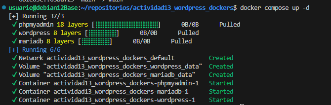

# Instalación de WordPress usando Docker Compose
 1. Lo primero para instlar wordpress en un contenedor docker compose es crear el el archivo docker-compose.yml para ello me he basado en uno ya hecho. Debe quedar similar a este.

 

 2. Una vez este creado el archivo docker-compose.yml debremos crear el archivo .env donde se almacenaran los valores de las variable utilizadas en el .yml

 

 3. Cuando estos archivos esten creados y la maquina tenga instalado docker ejecutaremos el siguiente comando desde el directorio donde esten dichos archivos para iniciar el contenedor.

    ```
    docker compose up -d
    ```

    Si todo está correcto debera aparecer algo similar a la siguiente imagen.
    

 4. Despues de esto ya podremos ir al navegador para introducir la ip de la maquina y terminar de configurar wordpress desde allí.
    

5. Cuando esta terminado de instalar y configurar ya podermos empezar a utilzarlo.

    
